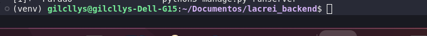

# Projeto banckend Lacrei

## Pre requisitos
- [Instalar Docker](https://docs.docker.com/get-docker/)
- [Instalar Docker compose](https://docs.docker.com/compose/install/)
- [Criar uma venv](https://docs.python.org/3/library/venv.html)
- [Instalar git para clonar o projeto](https://git-scm.com/book/pt-br/v2/Come%C3%A7ando-Instalando-o-Git)
- [Instalar python](https://www.python.org/downloads/)
- Ferramenta para testar a API
    - [Insomnia](https://insomnia.rest/download)
    - [Postman](https://www.postman.com/downloads/)

## Passo 1: baixar o projeto
Executre o comando abaixo para clonar o projeto ou baixe a pasta compatada.

[Link para acessar o repositório](https://github.com/gilcllys/lacrei-desafio-backend)
`` 
git clone https://github.com/gilcllys/lacrei-desafio-backend.git
``
## Passo 2: Criar a venv e instalar as libs

Primeiramente [crie uma venv](https://docs.python.org/3/library/venv.html) na raiz do projeto. Em seguida, após criada ative a venv.

Resulado após a ativação da venv

Com a sua venv ativada execute o seguinte comando para instalar todas as libs dentro da sua venv.

`` 
pip install -r requirements.txt
``
obs: No windows será necessário instalar manualmente a lib ``psycopg2``. Nessa caso, somente excute ``pip install psycopg2``

## Passo 2: Criar o arquivo com as variáveis de ambiente

Na raiz do projeto novamente crie uma arquivo chamado ``.env`` . Em seguida, cole as informações abaixo no arquivo recém criado.
``
DB_NAME = 'lacrei-database'
DB_USER = 'admin'
DB_PASSWORD = 'admin'
DB_HOST = 'localhost'
DB_PORT = '5432'
SECRET_KEY = 'django-insecure-pu8)4s&rhp6tpe@jw7*n_5ehir1er7i_%91_9u+htr46=yex-#'
``

## Passo 3: Rodando o container com o banco de dados Postgres

Na raiz do projeto execute o seguinte comando para subir o container do banco.
``docker-compose up -d``
Resultado dos dois containers rodando 

Resultado do pgadmin no navegador

## Passo 4: Rodando a aplicação Django
Etapa 1: Roda as migrações:
``python manage.py migrate``
Etapa 2: Rodar a aplicação:
``python manage.py runserver``
Etapa3: Acessar as rotas
``http://127.0.0.1:8000/swagger/``

## Passo 4: Cadastrando o primeiro perfil
Essa é uma API com autentificação JWT (JSON Web Token authentication), ou seja, é necessário ter um token de acesso para ter acesso os endpoints.

Etapa 1: Criar um perfil

Etapa 2: Obter os dois token de acesso (access token e refresh token)

Etapa 3: Criar o perfil profissional
- Inserir o token na requisição 

- Montar o payload de cadastro

Etapa 4: Listar o perfil criado
- Não esquecer de inserir o token em cada requisção feita.

